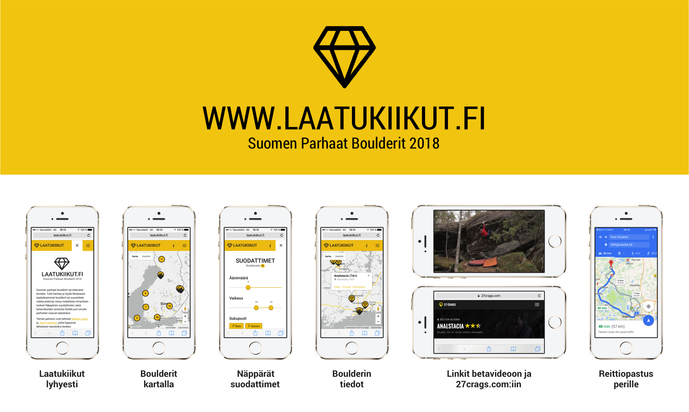

# www.laatukiikut.fi

The best boulder problems in Finland conveniently on the map.



## Development

First, replace the existing Google Maps JavaScript API key in `/2018/index.html` and `/2017/index.html` with your own. In case you are wondering how to get one, please follow the instructions at <https://developers.google.com/maps/documentation/javascript/get-api-key>.
```console
https://maps.googleapis.com/maps/api/js?v=3&key=YOUR_API_KEY&language=fi&region=FI
```

Next, start a simple web server in order to run the website locally:
```console
$ python -m http.server
```

After starting the web server, the website can be accessed at `http://localhost:8000/`.

## Technologies

HTML, CSS, JavaScript + third-party libraries: [Google Maps](https://developers.google.com/maps/documentation/javascript/), [MarkerClusterPlus](https://github.com/mahnunchik/markerclustererplus), [OverlappingMarkerSpiderfier](https://github.com/jawj/OverlappingMarkerSpiderfier), [Bootstrap](https://getbootstrap.com/), [jQuery](https://jquery.com/), [Google Fonts](https://fonts.google.com/), [Fontastic](http://fontastic.me/), [noUiSlider](https://refreshless.com/nouislider/), [Papa Parse](https://www.papaparse.com/), [wNumb](https://refreshless.com/wnumb/).

## Authors

Markku Laine (survey, coding, etc.) & Jussi Leskinen (icons)

## License

[MIT](./LICENSE)